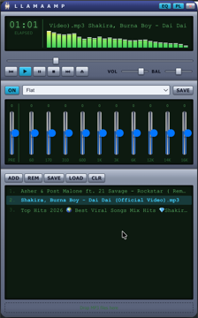

# Llama Amp

A tiny retro MP3 player for the desktop, inspired by classic Winamp — original blue/silver chrome skin, a llama mascot, and a real Web Audio equalizer that actually shapes the sound (not just decorative sliders).



## Features

- Play/pause/stop/prev/next, seek bar with elapsed/remaining time, volume + balance
- 10-band graphic equalizer (60Hz–16kHz) with presets, a preamp, and an on/off toggle — implemented with real `BiquadFilterNode`s, not cosmetic
- Editable playlist: add via file picker or drag-and-drop from Finder, reorder, remove, save/load as JSON
- Registered as a Finder "Open With" handler and a "Set As Default" candidate for mp3/m4a/wav/ogg/oga/flac/opus/weba — double-click or Open-With a file and it launches (or focuses the running instance) and plays it immediately
- Retro spectrum-bars / oscilloscope visualizer (click it to cycle modes)
- A llama in the LCD panel that nods its head along to the music
- Shuffle: plays every track once before repeating (Fisher-Yates), not random-each-time
- Local files only — no bundled tracks, no network streaming, no telemetry

## Getting started

```bash
git clone https://github.com/soodrajesh/llama-amp.git
cd llama-amp
npm install
npm start
```

`npm start` runs the app in dev mode via Electron Forge + Vite, with hot-reload for the renderer (HTML/CSS/JS).

## Building a standalone app

```bash
npm run package   # unpacked .app in out/Llama Amp-darwin-<arch>/
npm run make       # distributable (zip on macOS)
```

**Known issue:** in some environments `npm run package` / `npm run make` hangs indefinitely partway through (after the Vite build completes, during native packaging). If that happens, package manually instead:

```bash
# from the project root, after `npm start` has produced a .vite/ build at least once
PROJECT="$(pwd)"
TEMPLATE="$PROJECT/node_modules/electron/dist/Electron.app"
APP="$PROJECT/out/Llama Amp-darwin-arm64/Llama Amp.app"

rm -rf "$APP"
mkdir -p "$(dirname "$APP")"
ditto "$TEMPLATE" "$APP"

APPDIR="$APP/Contents/Resources/app"
mkdir -p "$APPDIR/.vite"
ditto "$PROJECT/.vite/build" "$APPDIR/.vite/build"
ditto "$PROJECT/.vite/renderer" "$APPDIR/.vite/renderer"
cp "$PROJECT/package.json" "$APPDIR/package.json"
cp "$PROJECT/assets/icon.icns" "$APP/Contents/Resources/icon.icns"

mv "$APP/Contents/MacOS/Electron" "$APP/Contents/MacOS/Llama Amp"
PLIST="$APP/Contents/Info.plist"
/usr/libexec/PlistBuddy -c "Set :CFBundleName Llama Amp" "$PLIST"
/usr/libexec/PlistBuddy -c "Set :CFBundleDisplayName Llama Amp" "$PLIST"
/usr/libexec/PlistBuddy -c "Set :CFBundleExecutable Llama Amp" "$PLIST"
/usr/libexec/PlistBuddy -c "Set :CFBundleIdentifier com.llamaamp.app" "$PLIST"
/usr/libexec/PlistBuddy -c "Set :CFBundleIconFile icon.icns" "$PLIST"

# electron-packager applies packagerConfig.extendInfo (forge.config.js) automatically;
# this manual path bypasses that, so the Open With / document-type registration has
# to be merged into Info.plist by hand.
python3 - "$PLIST" <<'PYEOF'
import plistlib, sys
p = sys.argv[1]
with open(p, "rb") as f:
    data = plistlib.load(f)
data["CFBundleDocumentTypes"] = [{
    "CFBundleTypeName": "Audio File",
    "CFBundleTypeRole": "Viewer",
    "LSHandlerRank": "Alternate",
    "LSItemContentTypes": [
        "public.mp3", "com.apple.m4a-audio", "com.microsoft.waveform-audio",
        "org.xiph.ogg-audio", "org.xiph.flac", "org.xiph.opus",
    ],
}]
data["UTImportedTypeDeclarations"] = [
    {"UTTypeIdentifier": "org.xiph.ogg-audio", "UTTypeConformsTo": ["public.audio"],
     "UTTypeDescription": "Ogg Audio", "UTTypeTagSpecification": {"public.filename-extension": ["ogg", "oga"]}},
    {"UTTypeIdentifier": "org.xiph.flac", "UTTypeConformsTo": ["public.audio"],
     "UTTypeDescription": "FLAC Audio", "UTTypeTagSpecification": {"public.filename-extension": ["flac"]}},
    {"UTTypeIdentifier": "org.xiph.opus", "UTTypeConformsTo": ["public.audio"],
     "UTTypeDescription": "Opus Audio", "UTTypeTagSpecification": {"public.filename-extension": ["opus", "weba"]}},
]
with open(p, "wb") as f:
    plistlib.dump(data, f)
PYEOF

codesign --force --deep --sign - "$APP"
rm -rf "/Applications/Llama Amp.app"
cp -R "$APP" /Applications/

# Finder/LaunchServices cache app→document-type bindings and won't pick up a
# replaced bundle's CFBundleDocumentTypes on their own; force a re-scan and
# restart Finder so "Open With" reflects the new registration immediately.
/System/Library/Frameworks/CoreServices.framework/Versions/A/Frameworks/LaunchServices.framework/Versions/A/Support/lsregister -f "/Applications/Llama Amp.app"
killall Finder
```

This is the same manual packaging method [documented by Electron itself](https://www.electronjs.org/docs/latest/tutorial/application-distribution) — it just skips whatever `electron-packager` is getting stuck on.

**Always `rm -rf` the target `.app` before both the `ditto`/ `cp -R` steps above.** `ditto` and `cp -R` merge into an existing bundle rather than replacing it, so re-running this script over a stale `out/.../*.app` or a stale `/Applications/Llama Amp.app` can leave old Vite-hashed asset files (e.g. a stale `index-*.css`) sitting alongside the new ones — the app then loads whichever one Electron happens to reference first, silently serving old code even though packaging "succeeded."

Since the app is ad-hoc signed (not notarized), the first launch from Finder needs **right-click → Open** to get past Gatekeeper. After that it opens normally.

If you're running commands from inside an Electron-based tool's integrated terminal (including some AI coding assistants), unset `ELECTRON_RUN_AS_NODE` first — if it's set, any Electron binary you launch from that shell runs as plain Node.js instead of a GUI app:

```bash
env -u ELECTRON_RUN_AS_NODE npm start
```

A normal Terminal or double-clicking the app from Finder is unaffected.

## Tech stack

Electron + Vite (via Electron Forge), plain HTML/CSS/JS — no frontend framework. Audio graph: `<audio>` → `MediaElementAudioSourceNode` → preamp `GainNode` → 10× `BiquadFilterNode` → `StereoPannerNode` → master `GainNode` → `AnalyserNode` → destination.

Tracks are streamed straight from disk via a custom `llama-media://` protocol (registered in `src/main/main.js`, backed by Electron's `net.fetch` on the `file://` URL with hand-rolled `Range`/`Content-Range` handling) rather than read whole into memory and copied across IPC. The renderer runs under a strict `Content-Security-Policy` and a sandboxed, context-isolated preload with a narrow `window.api` surface — no raw `ipcRenderer` exposure.

Launch-with-file is handled two ways, since macOS and Windows/Linux don't agree on how a "open this file with this app" request reaches the process: macOS delivers it as an `open-file` Apple Event (handled before `app.whenReady()`, since it can fire on cold launch), while Windows/Linux pass the path as an argv entry, picked up either at launch or via `second-instance` (the app takes a single-instance lock so a second launch-with-file focuses the existing window instead of opening a duplicate).

## License

MIT
